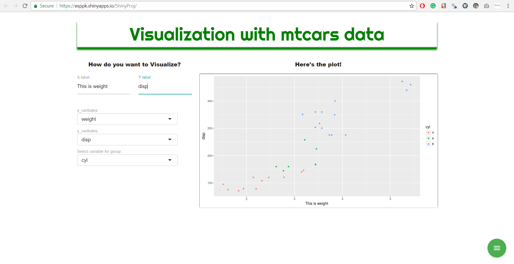
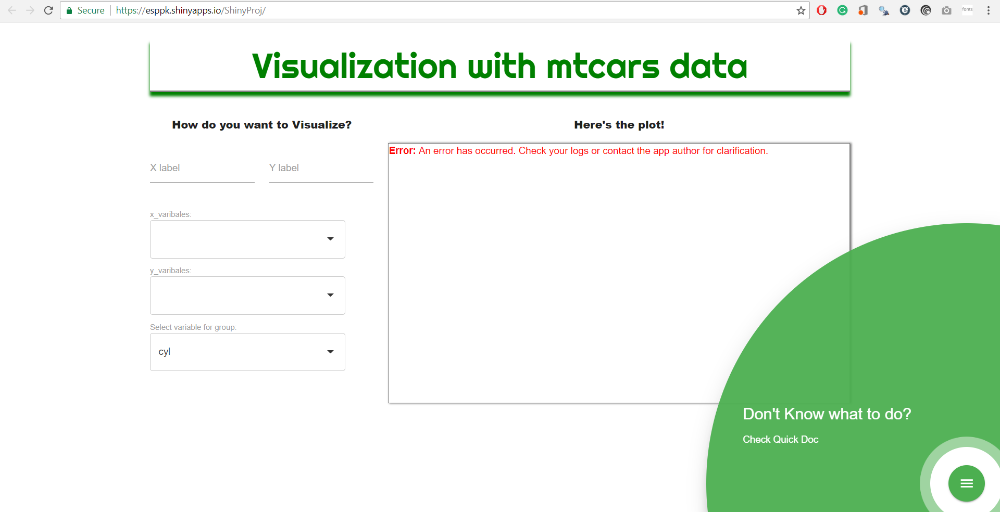
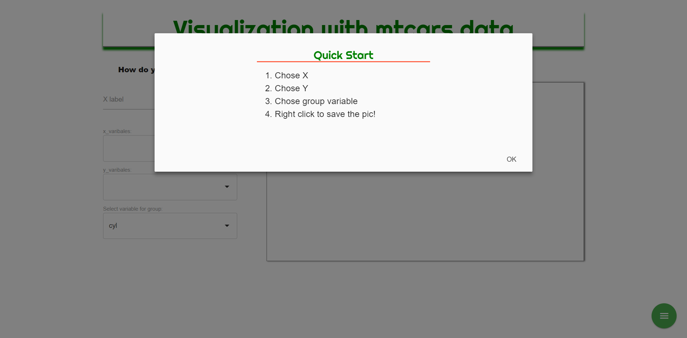

## Intro

- The shiny app is a simple plotting app for mtcars dataset. 
- It allow you to choose varibles with clicks.
- You can customize labels for both axes.




## features

- Welcome with feature discovery 


## features

- Popup quickStart feature


## Code 


```{r, echo=FALSE}
suppressPackageStartupMessages(library(ggplot2))
```

Equavelant code.

```{r, height = 480}
ggplot(mtcars, aes(mpg, wt, col = factor(cyl))) + 
    geom_point(alpha = 0.8) + 
    labs(x = "mpg", y = "weight")
```

